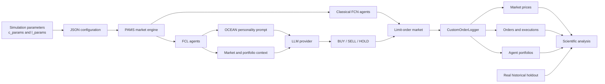

# Hybrid Financial Markets with LLM Agents

<div align="center">

**An agent-based research framework for studying whether large language model agents can help artificial markets reproduce real financial behavior.**

[](https://www.python.org/)
[](https://jupyter.org/)
[](https://github.com/masanorihirano/pams)
[](#research-scope)

[Overview](#overview) · [Architecture](#architecture) · [Quick Start](#quick-start) · [Scientific Validation](#scientific-validation) · [Project Structure](#project-structure)

</div>

---

## Overview

This project simulates artificial financial markets populated by two families of agents:

- **FCN agents** combine fundamentalist, chartist, and noise-driven strategies.
- **FCL agents** extend the classical FCN behavior with decisions generated by a large language model.

The central research question is not whether an LLM can predict the next market price. Instead, the project asks:

> **Does introducing behaviorally heterogeneous LLM agents help an artificial market reproduce empirical properties observed in real financial markets?**

The framework supports classical and hybrid experiments, order-book execution, OCEAN-inspired personalities, local and cloud LLM providers, real-market holdout validation, API cost estimation, and a scientific analysis layer based on stylized facts.

## Highlights

- Classical **fundamentalist-chartist-noise** market baseline.
- Hybrid markets combining FCN and LLM-controlled FCL agents.
- Custom order, execution, and portfolio logging.
- OCEAN-inspired financial personalities for behavioral experiments.
- Provider support for **Ollama, local Transformers, Groq, NVIDIA, and Alibaba Cloud**.
- Pre-flight estimates of LLM calls, tokens, and API cost.
- Reproducible JSON configuration generation.
- Local S&P 500 historical dataset workflow with known-history/future-holdout separation.
- Tick-to-real-time alignment for comparing artificial and empirical trajectories.
- Paper-oriented metrics, plots, and statistical tests.

## Research Scope

The main objective is to evaluate **market realism** through emergent statistical and behavioral properties:

1. Do simulated returns exhibit fat tails?
2. Does volatility cluster through time?
3. Is trading activity related to volatility?
4. Does the market reproduce path dependence around an all-time high?
5. Do LLM personalities alter liquidity, order imbalance, and portfolio allocation?

The comparison with a real S&P 500 window is a **complementary validation exercise**. It measures trajectory distance after aligning simulated ticks with daily observations, but it is not evidence of forecasting ability.

## Architecture



The LLM only supplies a categorical trading intention. Order pricing, sizing, market matching, execution, cash, and asset accounting remain deterministic responsibilities of the simulation engine and agent logic.

## Agent Models

### FCNAgent

The classical agent combines three signals:

| Component | Interpretation |
|---|---|
| Fundamental weight | Tendency to trade toward the fundamental value |
| Chart weight | Response to recent price trends |
| Noise weight | Heterogeneous stochastic behavior |
| Mean-reversion time | Horizon used to evaluate convergence toward fundamentals |
| Time window | Historical window available to the strategy |
| Order margin | Price range used to place orders around the expected value |

### FCLAgent

`FCLAgent` inherits from the PAMS `FCNAgent` and adds:

- LLM-based `BUY`, `SELL`, or `HOLD` intention.
- Personality-conditioned prompts.
- Market context, all-time-high/low information, and portfolio state.
- Multiple local and cloud model backends.
- Trading-history awareness.
- Portfolio allocation traces.
- Custom order and execution logging.

### OCEAN-Inspired Personalities

| Profile | Financial interpretation |
|---|---|
| Explorer | Seeks breakouts and tolerates volatility |
| Fundamentalist | Trades around the reference or fundamental price |
| Follower | Follows momentum and herd behavior |
| Contrarian | Trades against euphoria and panic |
| Defensive | Prioritizes capital preservation and loss avoidance |

These profiles are experimental prompt treatments. They are intended to create controlled behavioral differences, not to diagnose human personality.

## Project Structure

```text
intro_la_inv/
├── main.ipynb                  # Main simulation and experiment workflow
├── results.ipynb               # Results exploration and reporting
├── data/
│   └── real/                   # Local historical market data
├── jsons/
│   ├── classic/                # Generated classical configurations
│   ├── llms/                   # Generated hybrid configurations and cost estimates
│   └── examples/               # Reference PAMS configurations
├── results/
│   ├── classic/                # Classical market outputs
│   └── llms/                   # Hybrid market outputs
├── utils/
│   ├── simulation_utils.py     # Configuration, execution, scenarios, and backtests
│   ├── simulation_analysis.py  # Metrics, tests, alignment, and plots
│   ├── fcla.py                 # FCLAgent and custom logger
│   ├── personalities.py        # OCEAN-inspired prompt profiles
│   ├── apis.py                 # LLM providers, context, and cost estimation
│   ├── local_models.py         # Local Transformers inference
│   └── data_visualization.py   # Simulation visualizations
├── pyproject.toml
└── uv.lock
```

## Quick Start

### 1. Install the environment

The project requires Python `3.11.13` or newer.

Using [`uv`](https://docs.astral.sh/uv/):

```bash
uv sync
```

Or using `pip`:

```bash
python -m venv .venv
.venv\Scripts\activate
pip install -e .
```

Start Jupyter:

```bash
uv run --with jupyterlab jupyter lab
```

Then open [`main.ipynb`](main.ipynb).

### 2. Run a classical market

```python
from utils import simulation_utils as su

c_params = {
    "iter_steps": [200, 1000],
    "tickSize": 0.25,
    "marketPrice": 7542.16,
    "fundamental_price": 7580.06,
    "total_agents": 400,
    "asset_vol": 80,
    "cash_am": 900000.0,
    "mean_rev_time": [40, 120],
    "time_window": [20, 90],
    "order_margin": [0.0005, 0.004],
}

su.sim_loop(
    "classic_sp500_example",
    c_params,
    hybrid=False,
)
```

The first value in `iter_steps` is the warm-up phase. Orders are placed during warm-up, but execution is disabled so the limit-order book can develop before trading begins.

### 3. Run a hybrid market

```python
import os
from utils import simulation_utils as su

l_params = {
    "total_agents": 5,
    "asset_vol": 80,
    "cash_am": 900000.0,
    "mean_rev_time": [40, 120],
    "time_window": [20, 90],
    "order_margin": [0.0005, 0.004],
    "ref_price": 7580.06,
}

runner, logger = su.sim_loop(
    "hybrid_sp500_example",
    c_params,
    l_params=l_params,
    hybrid=True,
    provider="groq",
    model="llama-3.1-8b-instant",
    api_key=os.environ["GROQ_API_KEY"],
)
```

Before execution, a hybrid run prints and saves an estimated number of LLM calls, token usage, and monetary cost.

<details>
<summary><strong>Supported LLM providers</strong></summary>

| Provider value | Backend | Typical credential |
|---|---|---|
| `ollama` | Local Ollama server | None |
| `local` | Local Hugging Face Transformers model | Optional HF token |
| `groq` | Groq API | `GROQ_API_KEY` |
| `nvidia` | NVIDIA inference endpoint | `NVIDIA_API_KEY` |
| `alibaba` | Alibaba Cloud Model Studio / DashScope | `ALIBABA_API_KEY` |

Model availability and pricing change over time. Review the selected provider's current documentation before running a large experiment.

</details>

## Ready-to-Run Scenarios

The scenario catalog includes:

```python
from utils import simulation_utils as su

scenarios = su.market_scenario_catalog(
    iter_steps=(200, 1000),
    llm_agents=5,
    classic_agents=400,
)

print(scenarios.keys())
```

| Scenario | Purpose |
|---|---|
| `sp500_index_baseline` | Baseline initialized around an S&P 500 reference value |
| `sp500_risk_off_shock` | Lower fundamental value and wider order margins |
| `colombia_coffee_fnc_spot` | Colombian internal coffee-price reference |
| `coffee_ice_export_proxy` | Coffee C export-market proxy |

Reference values initialize and calibrate the artificial environment. They do not make the simulation a direct replica or predictor of the corresponding real market.

## Scientific Validation

Run the complete analysis for a saved simulation:

```python
from utils import simulation_analysis as sa

report, artifacts = sa.analyze_simulation(
    sim_type="llms",
    file_name="hybrid_sp500_example",
    comparison_warmup_steps=200,
)

dashboard = sa.full_metric(report, artifacts)
dashboard["macro"]
dashboard["micro"]
```

The loader automatically resolves the market, order, execution, and portfolio files generated for the selected experiment.

### Primary Market-Realism Metrics

| Metric | Scientific role |
|---|---|
| Excess kurtosis | Detects fat-tailed returns and unusually frequent extreme movements |
| Absolute-return autocorrelation | Measures volatility clustering at several lags |
| Volume-volatility correlation | Tests whether activity rises with price variation |
| All-time-high regression coefficient | Measures path dependence near the historical maximum |
| Order nearness to all-time high | Compares buy and sell behavior near peak prices |
| Asset proportion | Evaluates portfolio concentration and stability |
| Order-flow imbalance | Detects one-sided LLM trading behavior |
| KS and Mann-Whitney tests | Compare contextual buy and sell distributions |

### Representative Findings

The completed reference runs produced the following market-realism indicators:

| Scenario | Excess kurtosis | Lag-1 volatility clustering | Volume-volatility correlation |
|---|---:|---:|---:|
| Classical FCN baseline | 40.8384 | -0.0302 | 0.4071 |
| Hybrid FCL-LLM baseline | 12.5295 | 0.0636 | 0.5235 |
| Contrarian FCL treatment | 18.6158 | 0.0466 | 0.6021 |

Positive excess kurtosis indicates that all three dynamic scenarios generated heavier-tailed returns than a Gaussian benchmark. The hybrid baseline and contrarian treatment also showed positive short-horizon absolute-return autocorrelation and a stronger relationship between trading volume and volatility.

Personality sensitivity experiments revealed an important market-design result: homogeneous follower and defensive populations submitted one-sided intentions but lacked complementary counterparties, so their prices remained static. The contrarian treatment generated both buy and sell activity and therefore sustained executions without requiring another personality profile.

> [!NOTE]
> These values describe specific experimental runs. Robust inference requires repeated simulations, multiple seeds, and uncertainty intervals.

### Complementary Real-vs-Simulated Metrics

| Metric | Interpretation |
|---|---|
| MAE | Average absolute price error |
| RMSE | Error measure with stronger penalties for large deviations |
| MAPE / SMAPE / WAPE | Relative trajectory error |
| Theil's U | Performance relative to a random-walk baseline |
| Directional accuracy | Agreement between real and simulated return signs |
| Return correlation | Linear co-movement between return series |
| KL divergence | Asymmetric difference between return distributions |
| Hellinger distance | Bounded distance between return distributions |

## Real-Data Holdout Workflow

Historical data is read locally from `data/real/`. CSV files are intentionally excluded from version control, so place `sp500_index.csv` in that directory after cloning the repository. The expected S&P 500 columns are `Date` and `S&P500`.

The realistic backtest workflow separates the series into:

1. **Known history**, available for calibration and agent context.
2. **Future holdout**, hidden during simulation and reserved for evaluation.

```python
from utils import simulation_utils as su

prepared = su.prepare_realistic_backtest_scenario(
    "sp500_index_baseline",
    iter_steps=(200, 1000),
    llm_agents=5,
    real_data_config={
        "local_path": "data/real/sp500_index.csv",
        "current_agent_knowledge": "2024-11-21",
        "holdout_steps": 20,
    },
)

su.run_prepared_market_scenario(
    prepared,
    hybrid=False,
)
```

The workflow estimates the relationship between artificial ticks and real observations, trims the warm-up period, aligns both trajectories, and evaluates only the future interval that was not used for calibration.

> [!IMPORTANT]
> A tick is an artificial market event, not automatically one minute, hour, or day. Its empirical duration depends on the simulation horizon and the number of real holdout observations used for comparison.

## Generated Outputs

Each run can produce:

| Artifact | Contents |
|---|---|
| `*_base_results_fcn.csv` | Market price and volume time series |
| `*_orders.csv` | Submitted orders and agent identifiers |
| `*_executions.csv` | Matched trades, prices, and volumes |
| `*_agent_portfolios.csv` | Cash, holdings, value, and asset proportion |
| `*_cost_estimate.json` | Estimated LLM calls, tokens, and API cost |
| Scenario `.json` | Fully reproducible PAMS configuration |

Classical outputs are written to `results/classic/`; hybrid outputs are written to `results/llms/`.

## Experimental Context Features

The utility layer includes functions for constructing historical context from information available before an agent's knowledge cutoff. This functionality is experimental and was **not used to support the reported paper results**. It is retained for future work on retrieval-augmented agents and repeated prompt-generation experiments.

## Reproducibility Notes

- Keep the warm-up and trading phases identical when comparing scenarios.
- Record the model, provider, temperature, prompt profile, and API pricing assumptions.
- Use multiple random seeds before interpreting a personality effect as stable.
- Preserve the generated JSON configuration beside every result set.
- Never expose future holdout observations to calibration or agent prompts.
- Cloud LLM responses may vary between runs even when market parameters are unchanged.

## Security

Never commit API keys, access tokens, or credentials to the repository. Prefer environment variables:

```powershell
$env:GROQ_API_KEY = "your-key"
$env:NVIDIA_API_KEY = "your-key"
$env:ALIBABA_API_KEY = "your-key"
```

If a credential has ever appeared in source code, notebook output, a filename, or Git history, revoke and rotate it before publishing the repository.

## Limitations

- The framework is an experimental simulator, not a trading system.
- A single run cannot establish statistical robustness.
- LLM behavior depends on model version, sampling settings, provider, and prompt wording.
- Reference prices anchor initial conditions but do not reproduce the full information structure of a real exchange.
- Similar price levels do not imply similar return dynamics or predictive power.
- Realistic validation requires repeated simulations, confidence intervals, and sensitivity analysis.

## Research Paper

The accompanying paper develops the theoretical framework, implementation, experimental design, and interpretation of the classical and hybrid simulations. Its main evidence focuses on fat tails, volatility behavior, historical-maximum effects, order flow, and personality sensitivity; real-data trajectory comparison is treated as supplementary analysis.

## Citation

If this repository contributes to your research, cite the project using the final bibliographic information associated with the accompanying paper. A `CITATION.cff` file can be added once the author list, institution, title, and publication status are finalized.

## Disclaimer

This repository is provided for academic and educational research. It does not constitute financial advice, investment guidance, or a recommendation to trade any asset.
